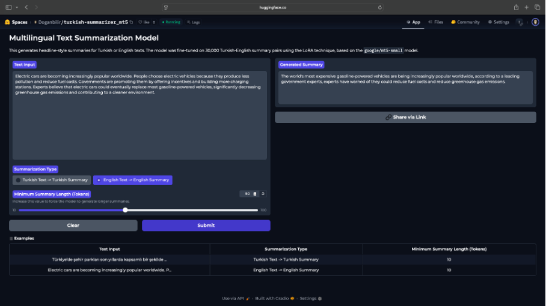
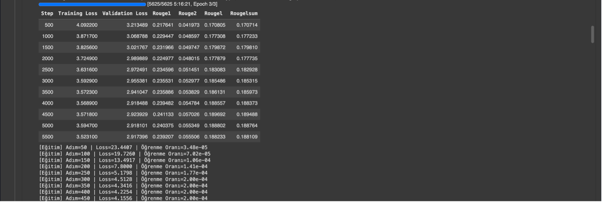

# Multilingual Text Summarization with RAG & mT5

This is an abstractive text summarization model developed to generate concise, platform-specific content from long-form Turkish SEO articles. The project utilizes the

google/mt5-small architecture, which was efficiently fine-tuned using the LoRA (Low-Rank Adaptation) technique.

The training procedure was executed on a Colab T4 GPU. It involved training for 3 epochs on a substantial Turkish dataset composed of

30,000 training samples and 3,000 validation samples, derived from the XLSum English and MLSUM Turkish subsets.

Technologies Used and Optimizations:

This project utilized modern and advanced techniques, particularly to overcome resource (GPU/VRAM) limitations:
Base Model: MT5-small
A multilingual, Sequence-to-Sequence (Seq2Seq) architecture model with 300 Million parameters, ideal for Abstractive summarization.
Dataset: XL-Sum
A large multilingual dataset including Turkish and English, used for training and validation.

LoRA (Low-Rank Adaptation)
A Parameter-Efficient Fine-Tuning (PEFT) technique. It drastically reduced training time and VRAM consumption by only training less than 1% of the model's parameters.
 
8-bit Quantization
Used Bitsandbytes library to reduce the model's memory footprint from 32-bit to 8-bit precision, ensuring the model fits onto the constrained Colab GPU VRAM.
Training Framework
Hugging Face transformers
Used for loading the model and professionally managing the training loop via the Seq2SeqTrainer and Seq2SeqTrainingArguments classes.

Project Architecture and Flow

The project was designed with a modular approach. The entire flow was organized into separate Python modules to enhance debuggability and reproducibility:
	1	Configuration (config.py): Centralized management of all static parameters like model name, dataset, and directory paths.
	2	Data Preparation Pipeline (data_prep.py):
	◦	Preprocessing: Tokenization and the "summarize:" task prefix were added, processed in parallel using map(batched=True) for speed. The Attention Mask was also generated here.
	3	Baseline Test (zero_shot.py): Established a reference point using ROUGE scores to objectively prove the improvement gained from fine-tuning.
	4	Model Training (train_lora.py): The model was fine-tuned using LoRA, 8-bit quantization, optimized hyperparameters, and EarlyStopping to prevent overfitting.
	5	Inference (inference_script.py): Loads the trained model efficiently using torch.no_grad() to generate summaries on test texts.

Success and Results

Metrics

 Initial low Loss values were successfully overcome through data subsetting and Learning Rate optimization. The model has successfully internalized the challenging Abstractive Summarization task. Also summarization skills of model improved and received better outputs.

Setup and Execution

Steps required to run the project in a local or Colab environment:
	1	Environment Setup: Install necessary libraries (transformers, peft, datasets, bitsandbytes, accelerate).
	2	Data Preparation: Run python data_prep.py to complete the data download and preprocessing steps.
	3	Training: Start the fine-tuning process with the command python train_lora.py.
	4	Testing: Check the output of the trained model using python inference_script.py.
